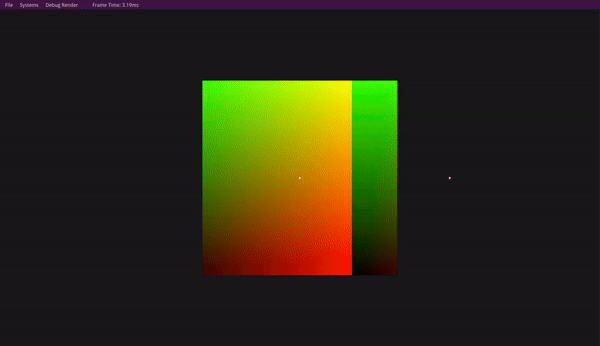
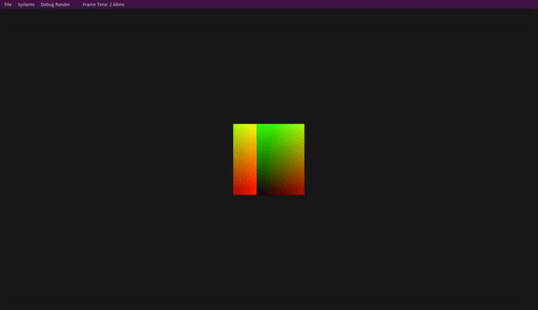
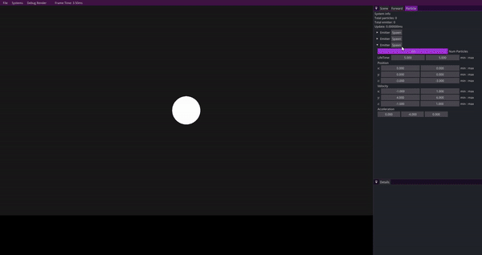

In this project I wanted to be able to update and render a large number of particles. First I needed to learn about compute shaders. So, I followed a basic tutorial on [learnopengl](https://learnopengl.com/Guest-Articles/2022/Compute-Shaders/Introduction) and made a simple animating texture. \
\
Next I wanted to get some particles rendering and moving around. I also wanted the particles to be completely stored and updated on the GPU so I learned about Shader Storage Buffer Objects or SSBO's. Once I got an SSBO working I wrote come compute shaders to init and update the buffer of particles and and vertex shader to render them instanced.
\
You can see in this gif individual particles will die off before others. Since this is on the GPU all the rendered particles had to be contiguous in memory. This means that dead particles had to be sorted out of the list which is difficult on GPU. To do this I implemented parallel prefix sum and even wrote an [article](/2024/04/12/parallel-prefix-sum) about implementing it. Of course after implementing the algorithm I thought of a simple solution that would work for my situation. The particles are given a random life time in a given range so I could just calculate how many should be alive at the point in time. If the number came out to be say 15 I would just update and render the first 15 particles in the list. This made it look like the particles were dying off at random without having to sort them out.
\
At this point I implemented billboard quads for the particles instead of rendering simple points. I wanted the particles to look a bit like sparks so I also added some code to the vertex shader to have extend towards the direction they were going. 
\
The final thing I did was refactor my code a bit to optimize rendering. I did this by creating one giant SSBO that would hold all the instance render data for the particles. This way I only need to make one draw call for all the particles. Above I set up the parameters to make the particles look like snow. The number of particles reaches 100,000. It can go up to 2 million but at that point the screen basically just turns white. I didn't have time to optimize any further but if I did I would have worked on the emitters. Each emitter has its own SSBO with particle update data so having too many of them can cause performance issues.
