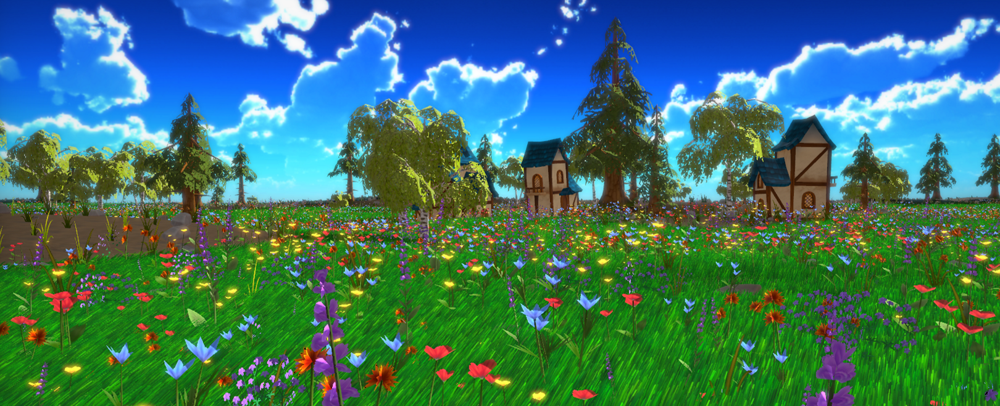

# Experience

**Languages** / C++ / Rust / Odin

---

**Tools** / Visual Studio / Visual Studio Code /  Unreal Engine / GitHub

---

**Platforms** / Windows / Playstation / Switch

---
\
**Libraries** / OpenGL / ImGUI / Jolt 

# Projects

## [GPU Accelerated Particle System](GPU Accelerated Particle System)
> Year 2 Student Project / Solo Programmer / 8 weeks

\
In this project all the particles are stored and updated entirely on the GPU. I learned a lot about how to write code and implement algorithms for compute shaders. I even wrote an article on how to implement [parallel prefix sum](/2024/04/12/parallel-prefix-sum).

## [Nature Sim Engine](Nature Sim Engine)
>Year 2 Student Project / Team of 11 / Programmer / 16 weeks

For this project I implemented vertex displacement to simulate vegetation moving in the wind. I also did some work for prop placement including generating transforms that are flush with the tessellated terrain. Finally, I implemented the camera / player movement and made some simple menu UI. The project can be found on [itch](https://buas.itch.io/blossom-engine).

## Meltdown Madness
> Year 1 Student Project / Team of 14 / Programmer / 8 weeks

## Rusterizer
> Student Project / Solo Programmer / 2 weeks